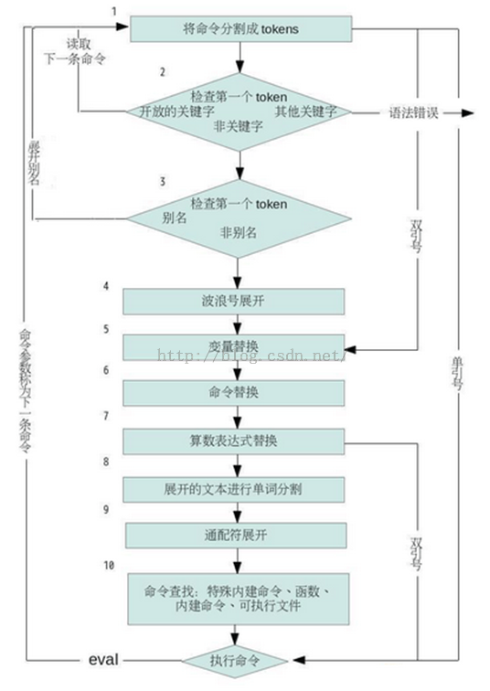

## shell 学习三十八天----执行顺序和 eval

### 执行顺序和 eval

shell 从标准输入或脚本中读取的每一行称为管道，它包含了一个或多个命令，这些命令被一个或多个管道字符 `(|)` 隔开。
 
事实上还有很多特殊符号可用来分割单个的命令：分号 `(；)`，管道 `(|)`，`&`，逻辑 `AND(&&)`，逻辑 `OR(||)`。对于每一个地区的管道，shell 都会将命令分割，为管道设置 I/O，并且对每一个命令依次执行下面的操作。



看起来很复杂，但是每一个步骤都是在 shell 的内存里发生的，shell 不会真的把每个步骤的发生演示给我们看。所以这是我们分析 shell 内存的情况，从而知道每个阶段的命令行是如何被转换的。

案例：

```
mkdir /tmp/x #建立临时性目录
cd /tmp/x #切换到该目录
touch f1 f2 #建立文件
f=f y=”a b” #赋值两个变量
echo ~+/${f}[12] $y $(echo cmd subst) $((3+2))>out      #忙碌的命令
```
 
上述命令的执行步骤：

1. 命令一开始会根据 shell 语法而分割为 token。最重要的一点是：I/O 重定向 `>out` 在这里是被识别的，并存储供稍后使用。流程继续处理下面这行，其中每个 token 的范围显示于命令下方的行上：
```echo ~+/${f}[12] $y $(echo cmd subst) $((3 + 2)) 
| 1 | |----- 2 ----| |3 | |-------- 4----------| |----5-----|``` 
2. 坚持第一个单词 `(echo)` 是否为关键字，例如 if 或 for。在这里不是，所以命令行不变继续执行。
3. 坚持第一个单词 (依然是 echo) 是否为别名。这里不是，所以命令行不变继续处理。
4. 扫描所有单词是否需要波浪号展开。在这里 `~+` 等同于 `$PWD`，也就是当前目录。token2 将被修改，处理继续如下：
```echo /tmp/x/${f}[12] $y $(echo cmd subst) $((3 + 2)) 
| 1 | |------- 2 -------| |3 | |-------- 4----------| |----5-----|``` 
5. 变量展开：token2 与 3 都被修改。产生：
```echo /tmp/x/${f}[12] a b $(echo cmd subst) $((3 + 2)) 
| 1 | |------- 2 -------| | 3 | |-------- 4----------| |----5-----|``` 
6. 处理命令替换。注意，这里可递归引用列表里的所有步骤! 在此例中，因为我们要试图让所有的东西容易理解，因此命令修改了 token4，结果：
```echo /tmp/x/${f}[12] a b cmd subst $((3 + 2)) 
| 1 | |------- 2 -------| | 3 | |--- 4 ----| |----5-----|```
7. 执行算术替换 。修改 token5，结果：
```echo /tmp/x/${f}[12] a b cmd subst 5 
| 1 | |------- 2 -------| | 3 | |--- 4 ----| |5|``` 
8. 前面所有的展开产生的结果，都将再一次被扫描，看看是否有 `$IFS` 字符。如果有，则他们是作为分隔符，产生额外的单词。例如，两个字符 `$y` 原来是组成一个单词，但展开式 “a 空格 b”，在此阶段被切分为两个单词：a 与 b。相同方式也应用于命令替换 `$(echo cmd subst)` 的结果上。先前的 token3 变成了 token3 与 4。先前的 token4 则成了 token5 与 6。结果：
```echo /tmp/x/${f}[12] a b cmd subst 5 
| 1 | |------- 2 -------| 3 4 |-5-| |- 6 -| 7```
9. 通配符展开。token2 变成了 token2 与 token3：
```echo /tmp/x/$f1 /tmp/x/$f2 a b cmd subst 5 
| 1 | |---- 2 ----| |---- 3 ----| 4 5 |-6-| |- 7 -| 8```
10. 这时，shell 已经准备好了要执行最后的命令了，他会去寻找 echo。正好 ksh93 与 bash 的 echo 都内建到 shell 中了
11.shell 实际执行命令。首先执行 `>out` 的 I/O 重定向，在调用内部的 echo 版本，显示最后的参数。
 
 
最后的结果：

```$cat out 
/tmp/x/f1 /tmp/x/f2 a b cmd subst 5
```
 
**eval 语句**

shell 中的 `eval` 这个命令很神奇，他能把字符串当做命令来执行。PS：这个字符串必须是可执行的 bash 命令才可以。

案例：

`eval "ls" #输出当前目录的所有文件`
 
语法：eval [参数]

补充说明：eval 可读取一连串的参数，然后再依惨呼本身的特性来执行。

参数：不限数目，彼此之间用分号隔开。

案例：我有一个文件 test.txt  
命令：`cat test.txt`  
输出：hello world  
命令：`myfile="cat test.txt"`  
命令：`echo $myfile`  
输出：cat test.txt  
命令：`eval $myfile`  
输出：hello world  

从 `eval $myfile` 这条命令可以看出，eval 进行了变量替换，将字符串中属于 `bash` 的命令执行了。把拼接起来的字符串当作命令执行，这就是 eval 的神奇之处。
 
**subShell 与代码块**

subShell 是一群被括在圆括号里的命令，这些命令会在另外的进程中执行。当你需要让一小组的命令在不同的目录下执行时，这种方式可以让你不必修改主脚本的目录，直接处理这种情况。

例如：`tar -cf -.| (cd /tmp；tar -xpf -)`

左边的 `tar` 命令会产生当前目录的 tar 打包文件，将他传送给标准输出。这份打包文件会通过管道传递给走遍的 subShell 里的命令。开头的 `cd` 命令会先切换到新目录，也就是让大宝文件在此目录下解开。然后，走遍的 tar 将从打包文件中解开文件。注意，执行此管道的 shell(或脚本) 并未更改他的目录。
 
代码块概念上与 subShell 雷同，只不过他不会建立新的进程。代码块里的命令以花括号 `({})` 括起来，且对主脚本的状态会造成影响 (例如他的当前目录)。一般来说，花括号被视为 shell 关键字，意即他们只有出现在命令的第一个符号时会被识别。实际上：这表示你必须将结束花括号放置在换行字符或分号之后。例如：

``` 
cd /home/directory||{
echo could not change to /home/directory!>&2
echo you lose !>&2
exit1
}
```

IO 重定向也可以套用 subShell 与代码块里。在该情况下，所有的命令会从重定向来源读取它们的输入或传送他们的输出。
                  
**subShell 与代码块**

```
结构
定界符
认可的位置
另外的进程
SubShell
()
行上的任何位置
是
代码块
{}
在换行字符，分号或关键字之后
否
```

注意：代码块里的 exit 会终止整个脚本。

我们通常在 shell 中运行一个脚本只需要简单的调用 `./[script_name]` 即可，这种方式下，shell 会启动一个子进程来运行该脚本，称为 subShell，当 subShell 运行完成，子进程结束。父进程的环境不会有任何改变。

案例：bash 代码

```
\#!/bin/bash
cd /var/cache
testname="fine"
```

分别在 shell 中运行

1.  `./test.sh；echo $testname`  会发现还是位于原来的目录中，`$testname` 的值书粗话为 null。
2. `source ./test.sh；echo $testname` 这里就不一样了，现在你位于 `/var/cache` 中，`$testname` 的值也变成了 fine
 
用 `source` 命令来运行脚本，不会产生子进程，脚本在 shell 的进程空间中执行，所以运行重定义的变量，执行的操作，都会在 shell 的运行环境中保留下来。
 

