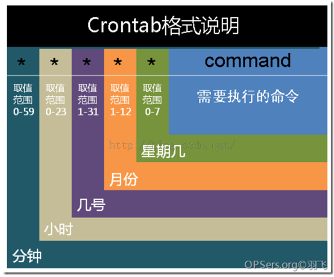

## shell 学习五十六天----延迟进程调度

### 延迟进程调度
 
前言：大部分时候，我们都希望进程快点开始，开点结束，别卡。而 shell 的执行，也是在前一个命令后，马上接着执行下一个命令。命令完成的速度是与资源的限制有关，且不在 shell 的权限下。
  
在交谈模式中使用下，有时不必等到命令完成才能执行另一个。这是 shell 提供的一个简单方式：所有的命令只要在最后加上 `&` 字符，都可起始于后台执行，无需等待。只有在少数情况下，必须等待后台进程完成。
 
稍稍有四种情况需要延时进程其实，知道未来的某个事件才执行。

第一种 sleep  
`sleep` 命令常用于在 shell 脚本中延迟时间
 
常用方式：  
格式：`sleep<n>`  
格式：`sleep<n>s`  
作用效果：延迟 <n> 秒  
 
格式：`sleep<n>m`  
作用效果：延迟 n 分钟  
 
格式：`sleep<n>h ` 
作用效果：延迟 n 小时  
 
格式：`sleep<n>d`  
作用效果：延迟 n 天  
 
注意：<n> 可以是小数  
 
案例  

`\# date；sleep 5；date`

2015 年 07 月 29 日 星期三 15：40：32 CST
2015 年 07 月 29 日 星期三 15：40：37 CST
 
**at：延迟至特定时间**

在 win 系统中，win 提供了计划任务这一功能，在控制面板 -> 性能与维护 -> 任务计划，它的功能就是安排自动运行的任务。通过” 添加任务计划” 的一步步引导，则可建立一个定时执行的任务。

在 linux 系统中你可能已经发现为什么系统常常会自动的进行一些任务? 这些任务到底是谁在支配他们工作的? 在 linux 系统如果你想让自己设计的备份程序可以自动的在某个时间点开始在系统低下运行，而不需要收到启动它，又该如何处置呢? 这些例行的工作可能又分为一次性定时工作与循环定时工作，在系统内有时那些服务在负责? 还有，如果你想要在每天的老婆过生日的时候送份礼物，一个老婆可能还好说，如果一多了，容易记不住，还容易记混了。

进入正题

at 命令的格式：  
`at [参数] [时间]`  
功能：在一个指定的时间指定一个指定任务，只能执行一次，且需要开启 `atd` 进程。  
 
备注：先使用 `ps -ef | grep atd` 查看，开启用 `/etc/init.d/atd start` 或者 `/etc/init.d/atd restart`；开机自启动：`chkconfig --level 2345 atd on ` 
 
参数：
  
```名称
说明
-m
当指定的任务被完成之后，将给用户发送邮件，即使没有标准输出
-I
atq 的别名
-d
atrm 的别名
-v
显示任务将被执行的时间
-c
打印任务的任荣到标准输出
-V
显示版本信息
-q< 队列 >
使用指定的队列
-f< 文件 >
从指定文件读入任务而不是从标准输入读入
-t< 时间参数 >
以时间参数的形式提交要运行的任务
``` 
 
`at` 允许使用一套相当复杂的指定时间的方法。他能够接受在当天的 hh：mm（小时：分钟）式的时间指定。假如该时间已过去，那么就放在第二天执行。当然也能够使用 midnight（深夜），noon（中午），teatime（饮茶时间，一般是下午 4 点）等比较模糊的 词语来指定时间。用户还能够采用 12 小时计时制，即在时间后面加上 AM（上午）或 PM（下午）来说明是上午还是下午。也能够指定命令执行的具体日期，指定格式为 month day（月 日）或 mm/dd/yy（月 / 日 / 年）或 dd.mm.yy（日. 月. 年）。指定的日期必须跟在指定时间的后面。上面介绍的都是绝对计时法，其实还能够使用相对计时法，这对于安排不久就要执行的命令是很有好处的。

指定格式为：`now + count time-units ，now` 就是当前时间，time-units 是时间单位，这里能够是 minutes（分钟）、hours（小时）、days（天）、weeks（星期）。count 是时间的数量，究竟是几天，还是几小时，等等。更有一种计时方法就是直接使用 today（今天）、tomorrow（明天）来指定完成命令的时间。
 
TIME：时间格式，这里可以定义出什么时候要进行 at 这项任务的时间，格式有：  
`HH：MM`   
`ex> 04：00`  

在今日的 HH：MM 时刻进行，若该时刻已超过，则明天的 HH：MM 进行此任务。  
`HH：MM YYYY-MM-DD`   
`ex> 04：00 2009-03-17 ` 

强制规定在某年某月的某一天的特殊时刻进行该项任务  
`HH：MM[am|pm] [Month] [Date] `  
`ex> 04pm March 17 ` 

也是一样，强制在某年某月某日的某时刻进行该项任务  
`HH：MM[am|pm] + number [minutes|hours|days|weeks] `   
`ex> now + 5 minutes`     
`ex> 04pm + 3 days `   
就是说，在某个时间点再加几个时间后才进行该项任务。  
 
案例：三天后的下午五点钟执行 `/bin/ls`  
```\#at 5pm+3days
at> /bin/ls
at><EOT>
job 7 at 2015-07-28 17：00
```
 
案例 2：明天 17 点钟，输出时间到指定文件中  
```\#at 17：20 tomorrow
at> date>/root/2015.log
at> <EOT>(输入完成需要按下 Ctrl+D 键)
job 8 at 2015-07-28 17：00```
 
案例 3：计划任务设定后，在没有执行之前我们可以用 atq 命令来查看系统没有执行工作任务命令：  
`\#atq`
 
案例 4：删除已经设置的任务  
`\#atrm 7`

详情  
```\#atq // 先使用 atq 命令查看当前系统设置的任务
8  2015-07-28 17：00 a root
7  2015-07-28 17：00 a root
\#atrm 7 // 删除设置的任务
\#atq // 查看任务
8  2015-07-28 17：00 a root```
 
案例 5：显示已经设置的任务内容  
`\#at -c 8`
 
**atd 的启动与 at 运行的方式**：

`atd` 的启动

要使用一次性计划任务时，我们的 linux 系统上面必须要有负责这个计划任务的服务，那就是 atd 服务。不过并不是所有的 linux 发行版本都是默认把它打开的，所以，某些时刻我们需要手动将 atd 服务激活才行。

激活的方式如下：  
`\#/etc/init.d/atd start 或者#/etc/init.d/atd restart`  
停止 atd：`\#/etc/init.d/atd stop`  
备注：设置一下自启动：`\#chkconfig atd on`
 
**at 的运行方式**

既然是计划任务，那么应该会有任务执行的方式，并且将这些任务排进行程表中。那么产生计划任务的方式是怎么进行的? 事实上，我们使用 `at` 这个命令来产生所要运行的计划任务，并将这个计划任务以文字档的方式写入 `/var/spool/at/` 目录内，该工作便能等待 `atd` 这个服务的取用与运行了。就这么简单。

不过，并不是所有的人都可以进行 `at` 计划任务。为什么? 因为系统安全的原因。很多主机被所谓的攻击破解后，最常发现的就是他们的系统当中多了很多的黑客程序，这些程序非常可能运用一些计划任务来运行或搜集你的系统运行信息，并定时的发送给黑客。所以，除非是你认可的帐号，否则先不要让他们使用 `at` 命令。那怎么达到使用 `at` 的可控呢?

我们可以利用 `/etc/at.allow` 与 `/etc/at.deny` 这两个文件来进行 `at` 的使用限制。加上这两个文件后，`at` 的工作情况是这样的：

- 先找寻 `/etc/at.allow` 这个文件，写在这个文件中的使用者才能使用 `at` ，没有在这个文件中的使用者则不能使用 `at` (即使没有写在 `at.deny` 当中)；
- 如果 `/etc/at.allow` 不存在，就寻找 `/etc/at.deny` 这个文件，若写在这个 `at.deny` 的使用者则不能使用 `at` ，而没有在这个 `at.deny` 文件中的使用者，就可以使用 `at` 命令了。
- 如果两个文件都不存在，那么只有 `root` 可以使用 `at` 这个命令。

透过这个说明，我们知道 `/etc/at.allow` 是管理较为严格的方式，而 `/etc/at.deny` 则较为松散 (因为帐号没有在该文件中，就能够运行 `at` 了)。在一般的 distributions 当中，由于假设系统上的所有用户都是可信任的，因此系统通常会保留一个空的 `/etc/at.deny` 文件，意思是允许所有人使用 `at` 命令的意思 (您可以自行检查一下该文件)。不过，万一你不希望有某些使用者使用 at 的话，将那个使用者的帐号写入 `/etc/at.deny` 即可！ 一个帐号写一行。
 
**batch：为资源控制而延迟**

跟 `at` 一样也是定期执行的命令，使用方法也跟 `at` 相同，但是不同的是 `batch` 不需要指定时间，因为它会自动在系统负载比较低的时候执行（平均负载小于 0.8 的时候）

**crontab：在指定时间再执行**
 
上面详细说了 `at` 命令的用法，循环运行的例行性计划任务，linux 系统则是由 `cron(crond)`
这个系统服务来控制的.linux 系统上面原本就有非常多的计划性工作，因此这个系统服务是默认启动的。另外，由于使用者自己也可以设置计划任务，所以，linux 系统也提供了使用者控制计划任务的命令：`crontab` 命令。
 
**crond 简介**

`crond` 四 linux 下用来周期性的执行某种任务或等待处理某些事件的一个守护进程，与 windows 下的计划任务类似，当安装完成操作系统后，默认会安装此项服务，并且会自启动 `crond` 进程，`crond` 进程每分钟会定期检查是否又要执行的任务，如果有要执行的文物，则会自动执行该任务。
 
**linux 下的任务调度分为两类，系统任务调度和用户任务调度**
 
系统任务调度；系统周期性所要执行的工作，比如写缓存数据到硬盘，日志清理。在 `/etc` 目录下有一个 `crontab` 文件，这个就是系统任务调度的配置文件。下面我们来看一下 `/etc/crontab` 这个文件：

```\# cat /etc/crontab
SHELL=/bin/bash
PATH=/sbin：/bin：/usr/sbin：/usr/bin
MAILTO=root
HOME=/
 \
\# For details see man 4 crontabs
\ 
\# Example of job definition：
\# .---------------- minute (0 - 59)
\# |  .------------- hour (0 - 23)
\# |  |  .---------- day of month (1 - 31)
\# |  |  |  .------- month (1 - 12) OR jan，feb，mar，apr ...
\# |  |  |  |  .---- day of week (0 - 6) (Sunday=0 or 7) OR sun，mon，tue，wed，thu，fri，sat
\# |  |  |  |  |
\# *  *  *  *  * user-name command to be executed```
 
前四行是用来配置 `crond` 任务运行的环境变量，第一行 shell 变量指定了系统要使用那个 shell，这里是 `ba` 是，第二行 PATH 变量指定了系统执行命令的路径，第三行 `MAILTO` 变量指定了 `crond` 的任务执行信息将通过电子邮件发送给 root 用户，如果 `MAILTO` 变量的值为空，则表示不发送任务执行信息给用户，第四行的 HOME 变量指定了在执行命令或脚本时使用的主目录。
 
用户任务调度：用户定期要执行的工作，比如用户数据备份，定是邮件提醒等。用户可以使用 `crontab` 工具来定制自己的计划任务，所有用户定义的 `crontab` 文件都被保存在 `/var/spool/cron` 目录中。其文件名和用户名一致。
 
使用者权限文件：

文件：  
`/etc/cron.deny // 该文件中国所列出的用户不能使用 crontab 命令`
 
文件：  
`/etc/cron/allow  // 该文件中所列出用户允许使用 crontab 命令`
 
文件：  
`/etc/spool/cron  // 所有用户 crontab 文件存放的目录，以用户名命名`
 
**crontab 文件的含义**：

用户所建立的 `crontab` 文件中，每一行都代表一项任务，每行的每个字段代表一项设置，他的格式分为六个字段，前五个字段是时间设定段，第六个字段是要执行的命令字段，格式如下：

`minute hour day month week command`

其中：

- `minute`：表示分钟，可以是从 0 到 59 之间的任何整数。
- `hour`：表示小时，可以是从 0 到 23 之间的任何整数。
- `day`：表示日期，可以是从 1 到 31 之间的任何整数。
- `month`：表示月份，可以是从 1 到 12 之间的任何整数。
- `week`：表示星期几，可以是从 0 到 7 之间的任何整数，这里的 0 或 7 代表星期日。
- `command`：要执行的命令，可以是系统命令，也可以是自己编写的脚本文件。
 
 

 
在以上各个字段中，还可以使用以下特殊字段：

- 星号 (*)：代表所有可能的值，例如 mouth 字段如果是星号，则表示在满足其他字段的制约条件后每月都执行该命令操作。
- 逗号 (，)：可以用逗号隔开的值制定一个列表范围，例如“1，2，3，4，，6，9”
- 中杠 (-)：可以用证书之间的中杠表示一个整数范围，例如“2-6”，表示”2，3，4，5，6”
- 正斜杠 (/)：可以用正斜杠指定时间的间隔频率，例如“0-23/2” 表示每两小数执行一次。同时正斜杠可以和星号一起使用，例如 */10，如果用在 minute 字段，表示没十分钟执行一次。
 
**crond 服务**

安装 crontab：  
`\#yum install crontabs`
 
服务操作说明：  
```\#/sbin/service crond start // 启动服务
\#/sbin/service crond stop // 关闭服务
\#/sbin/service crond restart // 重启服务
\#/sbin/service crond reload // 重新载入配置```
 
查看 crontab 服务状态：  
`\#service crond status`
 
手动启动 crontab 服务：  
`\#service crond start`

查看 crontab 服务是否已设置为开机启动，执行命令：  
`\#ntsysv`

加入开机自动启动：  
`\#chkconfig –level 35 crond on`
 
**crontab 详解**

格式：  
```crontab [-u user] file
crontab [-u user] [-e | -l |-r]```

功能：  
通过 `crontab` 命令，我们可以在固定的间隔时间执行指定的系统指令或 shell 脚本。时间间隔的单位可以是分钟，小时，日，月。周以及以上的任意组合。这个命令社尝试和周期性的日志分析或数据备份等工作。

参数：  
```选项名
说明
-u user
用来设定某个用户的 crontab 服务，例如”-u syx” 表示设定 syx 用户的 crontab 服务，这个参数一般有 root 用户来运行
file
file 是命令文件的名字，表示将 file 作为 crontab 的任务列表问价并载入 crontab。如果在命令行中没有指定这个文件，crontab 命令将接受标准输入 (键盘) 上键入的命令，并将它们载入 crontab
-e
编辑某个用户的 crontab 文件内容。如果不指定用户，则表示编辑当前用户的 crontab 文件。
-l
显示某个用户的 crontab 文件内容，如果不指定用户，则表示显示当前用户的 crontab 文件内容
-r
从 /var/spool/cron 目录中删除某个用户的 crontab 文件，如果不指定，你猜结果怎样?
-i
在删除用户的 crontan 文件时给确认提示。
```
 
**常用方法**

1. **创建一个新的 crontab 文件**  
在考虑向 `cron` 进程提交一个 `crontab` 文件时，首先要做的一件事情就是设置环境变量 `EDITOR`。`cron` 进程根据它来确定使用哪个编辑器编辑 `crontab` 文件。99% 的 linux 用户都是用 `vi`，如果你也是这样那么你就编辑 $HOME 目录下`.profile` 文件 (如果没有，就是`.bash_profile` 文件)，在其中加入这样一行：`EDITOR=vi；export EDITOR` 然后保存退出。不妨创建一个名为 `<user>cron` 的文件，其中 <user> 是用户名，例如，syxcron。在该文件中加入如下的内容  
      ```\# (put your own initials here)echo the date to the console every
      `# 15minutes between 6pm and 6am
      0，15，30，45 * * * * /bin/echo 'date' > /dev/console```
	保存并退出。确保前面五个域用空格分隔。
  
	在上面的例子中，系统每个 15 分钟向控制台输出依次当前时间。如果系统崩溃或挂起，从最后所显示的时间就可以一眼看出系统是什么时间停止工作的。在有些系统中，用 tty1 来表示控制台。可以根据实际情况对上面的粒子进行相应的修改。为了提交你刚刚创建的 crontab 文件，可以把这个新创建的文件作为 cron 命令参数。
	`\#crontab syxcron`
	现在该文件已经提交给 cron 进程，它每隔十五分钟运行一次。
	同时，新创建的文件的一个副本已经被放在 /var/spool/cron 目录中，文件名就是用户名 (即 syx)
	注意：这里容易出现 “bad minute” 及 “errors in crontab file，can't install” 错误。经确认，根本原因是 crontab 文件中时间格式定义不正确导致的。
	- crontab 时间格式内容 
```*    *    *    *    *    command
M    H    D    m    d    command
分   时   日   月   周   命令
第 1 列表示分钟 1～59 每分钟用 * 或者 */1 表示
第 2 列表示小时 1～23（0 表示 0 点）
第 3 列表示日期 1～31
第 4 列表示月份 1～12
第 5 列标识号星期 0～6（0 表示星期天）
第 6 列要运行的命令或脚本内容
```  
如果能掌握这个 crontab 的时间格式的定义，基本上就会避免出现 “bad minute” 错误。  

2. **列出 crontab 文件**  
为了列出 crontab 文件，可以用：  
`\#crontab -l // 你觉得这里要是数字 1 有意义吗?`
如果你跟着我做了这个案例，你就会看到和上面的内容一样：`0，15，30，45 * * * * /bin/echo 'date' > /dev/console`  
使用这种方法可以在 `$HOME` 目录中对 `crontab` 文件做一份备份：  
`\#crontab -l >$HOME/mycron`  

3. **编辑 crontab 文件**  
如果希望添加，删除或修改 crontab 文件中的条目，而 `EDITOR` 环境变量有舍值为 `vi`，可以使用 vi 来编辑 crontab 文件，命令：  
`\#crontab -e`  
	可以像使用 vi 编辑其他任何文件那样修改 crontab 文件并退出。如果修改了某些条目或添加了新的条目，那么在保存该文件时，cron 会对其进行必要的完整性检查。如果其中的某个域出现超出 = 允许范围的值，他就会提示你，我们在编辑 crontab 文件时，没准会加入新的条目。例如，加入下面一条：
```\# DT：delete core files，at 3.30am on 1，7，14，21，26，26 days of each month
30 3 1，7，14，21，26 * * /bin/find -name "core' -exec rm {} \；```  
	现在保存并退出。最好在 crontab 文件的每一个条目之上加入一条注释，这样就可以知道它的功能、运行时间，更为重要的是，知道这是哪位用户的作业。  
	现在让我们使用前面讲过的 crontab -l 命令列出它的全部信息：  
```$ crontab -l 
\# (crondave installed on Tue May 4 13：07：43 1999)
\# DT：ech the date to the console every 30 minites
0，15，30，45 18-06 * * * /bin/echo `date` > /dev/tty1
\# DT：delete core files，at 3.30am on 1，7，14，21，26，26 days of each month
30 3 1，7，14，21，26 * * /bin/find -name "core' -exec rm {} \；```

4. **删除 crontab 文件**  
要删除 crontab 文件，可以用：`\#crontab -r`  

5. **恢复丢失的 crontab 文件**  
如果不小心误删了 crontab 文件，假设你在自己的 `$HOME` 目录下还有一个备份，那么可以将其拷贝到 `/var/spool/cron/<username>`，其中 `<username>` 是用户名。如果由于权限问题无法完成拷贝，可以用：`$crontab <filename>`  
其中，<filename> 是你在 `$ HOME` 目录中副本的文件名。  

	我建议你在自己的 $HOME 目录中保存一个该文件的副本。我就有过类似的经历，有数次误删了 crontab 文件（因为 r 键紧挨在 e 键的右边）。这就是为什么有些系统文档建议不要直接编辑 crontab 文件，而是编辑该文件的一个副本，然后重新提交新的文件。

	有些 crontab 的变体有些怪异，所以在使用 crontab 命令时要格外小心。如果遗漏了任何选项，crontab 可能会打开一个空文件，或者看起来像是个空文件。这时敲 delete 键退出，不要按 <Ctrl-D>，否则你将丢失 crontab 文件。
 
 
**实例 1**：每 1 分钟执行一次 command  
命令：  
`* * * * * command`
 
**实例 2**：每小时的第 3 和第 15 分钟执行  
命令：  
`3，15 * * * * command`  
 
**实例 3**：在上午 8 点到 11 点的第 3 和第 15 分钟执行  
命令：  
`3，15 8-11 * * * command`
 
**实例 4**：每隔两天的上午 8 点到 11 点的第 3 和第 15 分钟执行  
命令：  
`3，15 8-11 */2 * * command`  
 
**实例 5**：每个星期一的上午 8 点到 11 点的第 3 和第 15 分钟执行  
命令：  
`3，15 8-11 * * 1 command ` 
 
**实例 6**：每晚的 21：30 重启 smb   
命令：  
`30 21 * * * /etc/init.d/smb restart`  
 
**实例 7**：每月 1、10、22 日的 4 ：45 重启 smb   
命令：  
`45 4 1，10，22 * * /etc/init.d/smb restart`  
 
**实例 8**：每周六、周日的 1 ：10 重启 smb  
命令：  
`10 1 * * 6，0 /etc/init.d/smb restart`  
 
**实例 9**：每天 18 ：00 至 23 ：00 之间每隔 30 分钟重启 smb  
命令：  
`0，30 18-23 * * * /etc/init.d/smb restart`  
 
**实例 10**：每星期六的晚上 11 ：00 pm 重启 smb   
命令：  
`0 23 * * 6 /etc/init.d/smb restart ` 
 
**实例 11**：每一小时重启 smb   
命令：  
`* */1 * * * /etc/init.d/smb restart ` 
 
**实例 12**：晚上 11 点到早上 7 点之间，每隔一小时重启 smb   
命令：  
`* 23-7/1 * * * /etc/init.d/smb restart`  
 
**实例 13**：每月的 4 号与每周一到周三的 11 点重启 smb  
命令：  
`0 11 4 * mon-wed /etc/init.d/smb restart`  
 
**实例 14**：一月一号的 4 点重启 smb   
命令：  
`0 4 1 jan * /etc/init.d/smb restart ` 

**实例 15**：每小时执行 /etc/cron.hourly 目录内的脚本  
命令：  
`01   *   *   *   *     root run-parts /etc/cron.hourly ` 

说明：
`run-parts` 这个参数了，如果去掉这个参数的话，后面就可以写要运行的某个脚本名，而不是目录名了
 
使用注意事项

1. **注意环境变量问题**  
有时我们创建了一个 `crontab`，但是这个任务却无法自动执行，而手动执行这个任务却没有问题，这种情况一般是由于在 `crontab` 文件中没有配置环境变量引起的。
	在 crontab 文件中定义多个调度任务时，需要特别注意的一个问题就是环境变量的设置，因为我们手动执行某个任务时，是在当前 shell 环境下进行的，程序当然能找到环境变量，而系统自动执行任务调度时，是不会加载任何环境变量的，因此，就需要在 crontab 文件中指定任务运行所需的所有环境变量，这样，系统执行任务调度时就没有问题了。

	不要假定 cron 知道所需要的特殊环境，它其实并不知道。所以你要保证在 shelll 脚本中提供所有必要的路径和环境变量，除了一些自动设置的全局变量。所以注意如下 3 点：

	- 脚本中涉及文件路径时写全局路径；
	- 脚本执行要用到 java 或其他环境变量时，通过 `source` 命令引入环境变量，如：
```cat start_cbp.sh
\#!/bin/sh
source /etc/profile
export RUN_CONF=/home/d139/conf/platform/cbp/cbp_jboss.conf
/usr/local/jboss-4.0.5/bin/run.sh -c mev &```
	- 当手动执行脚本 OK，但是 `crontab` 死活不执行时。这时必须大胆怀疑是环境变量惹的祸，并可以尝试在 crontab 中直接引入环境变量解决问题。如：
```0 * * * * . /etc/profile；/bin/sh /var/www/java/audit_no_count/bin/restart_audit.sh```

2. **注意清理系统用户的邮件日志**  
每条任务调度执行完毕，系统都会将任务输出信息通过电子邮件的形式发送给当前系统用户，这样日积月累，日志信息会非常大，可能会影响系统的正常运行，因此，将每条任务进行重定向处理非常重要。
例如，可以在 `crontab` 文件中设置如下形式，忽略日志输出：
```0 */3 * * * /usr/local/apache2/apachectl restart >/dev/null 2>&1```

	“/dev/null 2>&1” 表示先将标准输出重定向到 /dev/null，然后将标准错误重定向到标准输出，由于标准输出已经重定向到了 /dev/null，因此标准错误也会重定向到 /dev/null，这样日志输出问题就解决了。
3. **系统级任务调度与用户级任务调度**  
系统级任务调度主要完成系统的一些维护操作，用户级任务调度主要完成用户自定义的一些任务，可以将用户级任务调度放到系统级任务调度来完成（不建议这么做），但是反过来却不行，root 用户的任务调度操作可以通过 `“crontab –uroot –e”` 来设置，也可以将调度任务直接写入 `/etc/crontab` 文件，需要注意的是，如果要定义一个定时重启系统的任务，就必须将任务放到 `/etc/crontab` 文件，即使在 root 用户下创建一个定时重启系统的任务也是无效的。

4. **其他注意事项**  
新创建的 cron job，不会马上执行，至少要过 2 分钟才执行。如果重启 cron 则马上执行。
当 `crontab` 突然失效时，可以尝试 `/etc/init.d/crond restart` 解决问题。或者查看日志看某个 job 有没有执行 / 报错 `tail -f /var/log/cron`。

	千万别乱运行 crontab -r。它从 Crontab 目录（/var/spool/cron）中删除用户的 Crontab 文件。删除了该用户的所有 crontab 都没了。

	在 crontab 中 % 是有特殊含义的，表示换行的意思。如果要用的话必须进行转义 \%，如经常用的 date ‘+%Y%m%d’在 crontab 里是不会执行的，应该换成 date '+\%Y\%m\%d'。

简单的案例：[http：//www.ahlinux.com/start/cmd/20378.html](http：//www.ahlinux.com/start/cmd/20378.html)